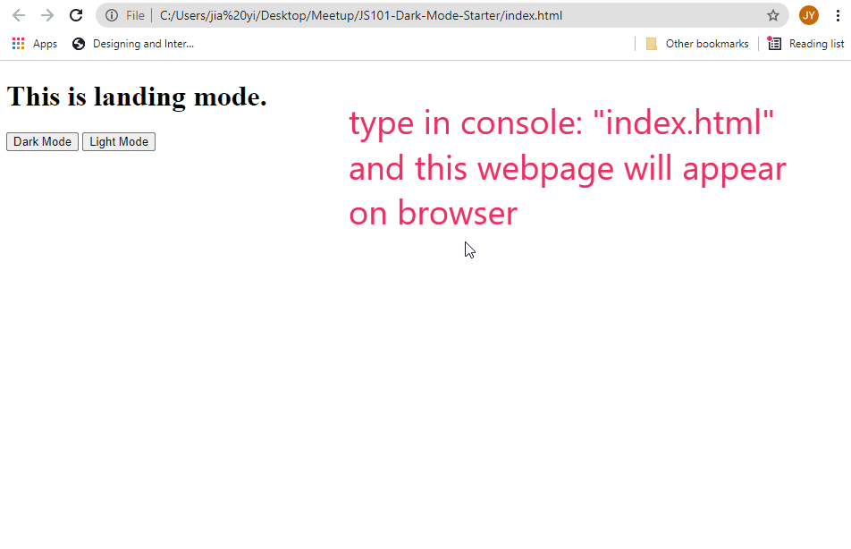

# JS101-Dark-Mode-Starter
This tutorial is a starter tutorial on the basics of HTML and Javascript. I made a simple app to demonstrate how to change color of fonts, background and use of buttons.

This is the output of the simple web application

